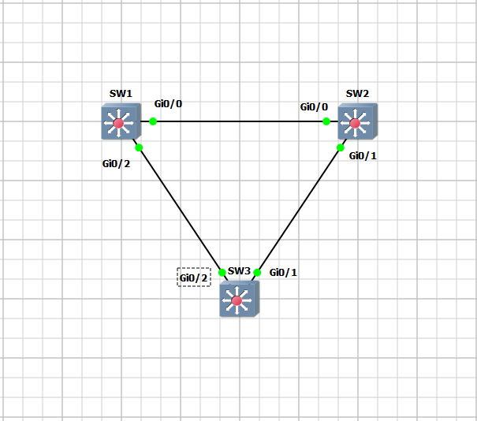

# Day 3: Advanced STP (MSTP)

**Objective:** Implement Multiple Spanning Tree Protocol (MSTP) to achieve Layer 2 Load Balancing and optimize bandwidth usage.



## 🎯 Features Enabled
* **MST Configuration:** Single region (`GNS3-LAB`) with Revision 1.
* **Instance Mapping:**
    * **Instance 1:** Mapped to VLAN 10 (Odd VLANs).
    * **Instance 2:** Mapped to VLAN 20 (Even VLANs).
* **Load Balancing:**
    * **SW1** is Primary Root for Instance 1.
    * **SW2** is Primary Root for Instance 2.
    * Traffic for VLAN 10 uses the left path, while VLAN 20 uses the right path.

## ⚙️ Configuration Snippets

### Enabling MST & Region Config (All Switches)
```bash
spanning-tree mode mst
!
spanning-tree mst configuration
 name GNS3-LAB
 revision 1
 instance 1 vlan 10
 instance 2 vlan 20
Root Bridge Manipulation (SW1 & SW2)
Bash

! SW1: Root for VLAN 10, Secondary for VLAN 20
spanning-tree mst 1 priority 4096
spanning-tree mst 2 priority 8192

! SW2: Root for VLAN 20, Secondary for VLAN 10
spanning-tree mst 1 priority 8192
spanning-tree mst 2 priority 4096
🧪 Verification results
Load Balancing Verified:

show spanning-tree mst shows different Root Bridges for Instance 1 and Instance 2.

Blocked ports are distributed differently per instance, utilizing all available uplinks.

💡 Key Takeaways
Unlike PVST+ (one instance per VLAN), MSTP groups VLANs into instances, significantly reducing CPU load on switches.

Successfully achieved traffic separation based on VLAN ID.