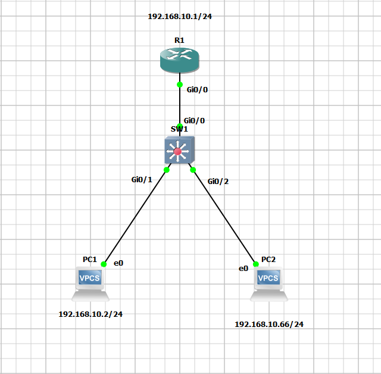

# Day 4: Layer 2 Security

**Objective:** Secure the access layer against Rogue DHCP, ARP Spoofing, and IP Spoofing.



## 🛡️ Features Enabled
* **DHCP Snooping:** Trusted Uplink (Gi0/0), Untrusted Access Ports.
* **Dynamic ARP Inspection (DAI):** Validates ARP packets against DHCP bindings.
* **IP Source Guard (IPSG):** L3 traffic filtering on user ports.

## ⚙️ Configuration Snippets (SW1)

```bash
! 1. DHCP Snooping & Option 82 Fix (Required for GNS3/IOSv)
ip dhcp snooping
ip dhcp snooping vlan 10
no ip dhcp snooping information option

! 2. Dynamic ARP Inspection
ip arp inspection vlan 10
interface Gi0/0
 ip dhcp snooping trust
 ip arp inspection trust

! 3. User Port Security (IPSG)
interface range Gi0/1-2
 ip dhcp snooping limit rate 10
 ip verify source
🧪 Verification results
Valid User (PC1): DHCP & Ping Successful.

Attacker (PC2): Static IP attempt Blocked by IPSG (Deny-All).

⚠️ Issues & Troubleshooting
DHCP Failure (Option 82): Router dropped DHCP packets because the switch inserted "Option 82" data.

Fix: Applied no ip dhcp snooping information option on the switch.

IPSG Simulation Bug: Valid traffic from PC1 was occasionally dropped despite correct bindings ("Active" status).

Resolution: Confirmed configuration logic is correct; identified as a known GNS3/IOSv data-plane emulation artifact.